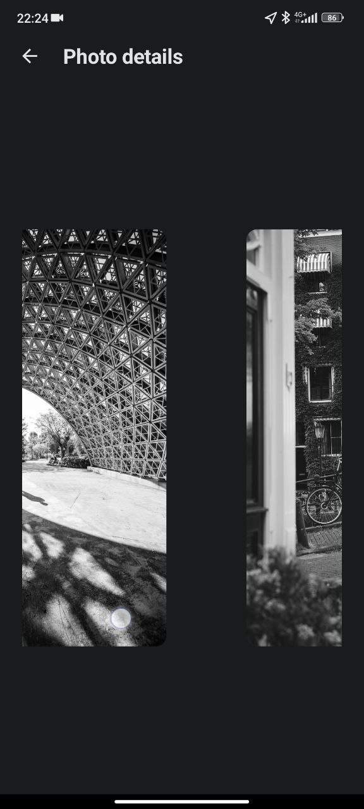
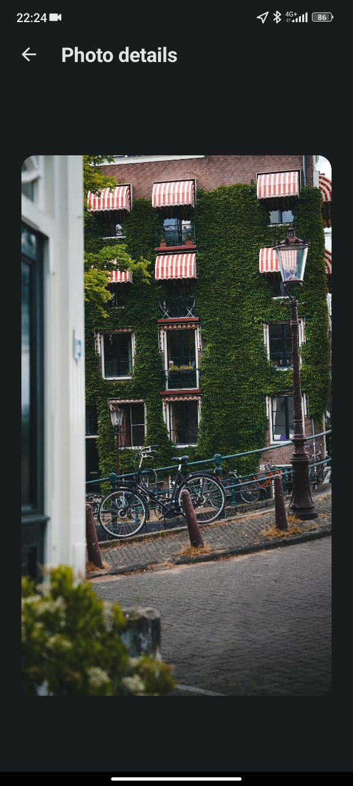

# A program written entirely in Kotlin using the principles of Clean Architecture according to the MVVM pattern.

An application for viewing images written in Kotlin language using Jetpack Compose.
Using the server [UnsplashApi](https://unsplash.com/documentation#creating-a-developer-account)

## Screenshots

## Libraries

* [Jetpack Compose](https://developer.android.com/jetpack/compose) Jetpack Compose is Android’s
  recommended modern toolkit for building native UI. It simplifies and accelerates UI development on
  Android. Quickly bring your app to life with less code, powerful tools, and intuitive Kotlin APIs.

* [Retrofit](https://square.github.io/retrofit/) A type-safe HTTP client for Android and Java

* [Koin](https://insert-koin.io/docs/quickstart/android/) A framework to help you build any kind of
  Kotlin & Kotlin Multiplatform application, from Android mobile, Multiplatform apps to backend Ktor
  server applications Koin is developed by Kotzilla and open-source contributors

* [Coroutines](https://kotlinlang.org/docs/coroutines-overview.html)
  Asynchronous or non-blocking programming is an important part of the development landscape. When
  creating server-side, desktop, or mobile applications, it's important to provide an experience
  that is not only fluid from the user's perspective, but also scalable when needed.
